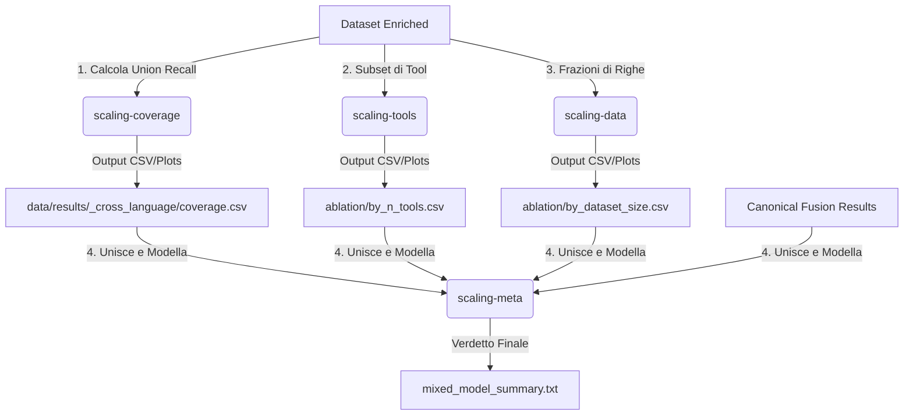

# Report Analisi di Scaling (FEAST)

Questo documento spiega nel dettaglio lo scopo, il funzionamento e la metodologia delle analisi di scaling collocate nella cartella [analysis/scaling/](file:///home/test/checcoalt/FEAST/analysis/scaling).

---

## Il Problema della Collinearità (La Motivazione)

Nei risultati dell'esperimento principale (il comando `fusion`), si osserva che le performance di fusione variano sensibilmente a seconda del linguaggio di programmazione:
* **C/C++** ottiene i risultati migliori.
* **Python** si colloca a metà.
* **Java** ottiene i risultati peggiori.

Tuttavia, confrontando semplicemente i tre linguaggi, è **impossibile capire perché** ci sia questa differenza di performance. Questo accade a causa del fenomeno statistico della **collinearità**: le possibili cause si muovono tutte insieme nello stesso verso.

```
C/C++ ──► + Strumenti (6)  ──► + Campioni (58k)  ──► + Copertura Union (High) ──► Miglior F1
Java  ──► - Strumenti (3)  ──► - Campioni (8.7k) ──► - Copertura Union (Low)  ──► Peggior F1
```

Se proviamo a fare un confronto a soli tre punti (i tre linguaggi), non possiamo stabilire se C/C++ funzioni meglio perché ha più strumenti nel pool, perché ha un dataset di addestramento più grande, perché gli strumenti hanno una maggiore copertura nativa sul codice, o semplicemente perché il C/C++ è un linguaggio più "facile" da analizzare.

Le quattro analisi di scaling servono a **isolare un fattore alla volta** per rompere questa collinearità e identificare i veri driver delle prestazioni di fusione.

---

## 1. Analisi di Copertura Cross-Language (Coverage)

### A cosa serve?
Risponde alla domanda: **"Il pool di strumenti, collettivamente, vede abbastanza in ciascun linguaggio?"**
Questa analisi valuta il *soffitto teorico* (ceiling) delle prestazioni che nessun algoritmo di fusione potrà mai superare. Se un bug non viene rilevato da *nessuno* strumento del pool, nessun fuser potrà mai trovarlo.

### Come funziona?
* Non esegue alcun ciclo di fusione o addestramento (è molto veloce).
* Analizza i dati arricchiti per calcolare la **Union (OR) Recall**: la percentuale di vulnerabilità reali rilevate da *almeno uno* strumento del pool.
* Calcola la **Oracle Headroom**: lo spazio di miglioramento teorico rimasto per gli algoritmi di fusione.

### Esecuzione e Output
```bash
uv run python main.py scaling-coverage
```
* **Output CSV**: `data/results/_cross_language/coverage.csv`
* **Output Grafico**: `data/results/_cross_language/union_recall_vs_n_tools.png`

> [!NOTE]
> **Scoperta chiave**: L'analisi di copertura mostra che la Union Recall di Java è in realtà molto alta. Questo significa che l'ipotesi *"Java performa peggio perché i suoi strumenti vedono troppo poco"* è **falsa**. Il potenziale teorico c'è, ma i fuser faticano a estrarlo.

---

## 2. Ablazione degli Strumenti (Tool Ablation)

### A cosa serve?
Risponde alla domanda: **"Aggiungere strumenti al pool aiuta davvero a migliorare la fusione, tenendo fermi il linguaggio e i dati?"**
Isola l'effetto del **numero di tool** ($N$) rimuovendo l'influenza della dimensione del dataset e della specificità del linguaggio.

### Come funziona?
* Prende un singolo linguaggio (ad esempio C/C++ che ha 6 tool).
* Esegue simulazioni di fusione su **tutti i possibili sottoinsiemi di strumenti** di dimensione $K$ (da 2 a $N$).
* Per ciascun sottoinsieme, esegue un intero ciclo di validazione incrociata (cross-validation) in una cartella temporanea (`scratch`).
* Registra le performance massime (`fusion_f1_max`) in funzione del numero di strumenti attivi.

### Esecuzione e Output
```bash
uv run python main.py scaling-tools --lang java
```
* **Output CSV**: `data/results/<lang>/pillar_child/full/ablation/by_n_tools.csv`
* **Output Grafico**: `data/results/<lang>/pillar_child/full/ablation/by_n_tools.png`

> [!WARNING]
> Questa analisi è **molto onerosa computazionalmente** perché esegue un run completo di fusione per ogni combinazione. Per C/C++ (6 tool), ci sono 57 combinazioni possibili.
> Si consiglia di limitarla usando i parametri `--sizes` e `--max-combos`, ad esempio:
> `uv run python main.py scaling-tools --lang c_cpp --sizes 2,4,6 --max-combos 4`

---

## 3. Ablazione della Dimensione del Dataset (Data Ablation)

### A cosa serve?
Risponde alla domanda: **"Il vantaggio di performance di un linguaggio sopravvive se rimpiccioliamo il suo dataset?"**
Isola l'effetto della **dimensione del dataset** (dimensione del campione) sulla performance, generando una "curva di apprendimento". Ad esempio, se riduciamo il dataset di C/C++ alla stessa dimensione di quello di Java, le performance di C/C++ crollano a livello di quelle di Java?

### Come funziona?
* Campiona i dati arricchiti del linguaggio selezionato a frazioni progressive (es. 10%, 25%, 50%, 75%, 100%).
* Per ogni frazione, ripete il campionamento più volte (`repeats=3`) con seed differenti per garantire stabilità statistica.
* Esegue la pipeline di fusione completa su ogni sottocampione e registra la F1 finale rispetto al numero di campioni reali utilizzati.

### Esecuzione e Output
```bash
uv run python main.py scaling-data --lang all
```
* **Output CSV**: `data/results/<lang>/pillar_child/full/ablation/by_dataset_size.csv`
* **Output Grafico**: `data/results/<lang>/pillar_child/full/ablation/by_dataset_size.png`

---

## 4. Meta-Regressione (Meta-Regression)

### A cosa serve?
Risponde alla domanda finale: **"Mettendo tutto insieme, qual è il fattore che determina realmente la differenza di performance? L'effetto sparisce se controlliamo per queste variabili?"**
Questa è la sintesi statistica che modella il comportamento cross-language. L'obiettivo è spiegare il "lift" della fusione (il guadagno rispetto alle euristiche tradizionali) non tramite l'etichetta del linguaggio (`java`, `python`, `c_cpp`), ma tramite covariate fisiche (numero di tool, log della dimensione dei dati, frazione di campioni mantenuti, copertura della union). Se ci riusciamo, i risultati sono generalizzabili anche a un ipotetico quarto linguaggio.

### Come funziona?
Combina due diversi approcci di regressione:

1. **Modello ad Effetti Misti (Mixed-Effects Model)**:
   * Mette in pila (stack) tutte le osservazioni per (famiglia CWE, fold) di tutti e tre i linguaggi.
   * Modella il guadagno di performance (`delta`) usando le covariate dei dataset e inserisce un **effetto casuale sulla famiglia CWE** (`family`).
   * *Risoluzione Collinearità*: Poiché i predittori a livello di linguaggio sono collinear, il modello rileva ed esclude automaticamente le variabili collinear (come `kept_frac` e `union_recall`) per evitare il fallimento matematico del solutore.
2. **Regressioni di Ablazione Internal (Within-Language)**:
   * Esegue regressioni OLS con errori standard robusti (clustered sul linguaggio) direttamente sulle tabelle generate dalle analisi 2 e 3 (`by_n_tools` e `by_dataset_size`).
   * Questo stima la pendenza (slope) del numero di strumenti e della dimensione dei dati *all'interno* di ciascun linguaggio singolarmente, dove il linguaggio stesso è mantenuto costante.

### Esecuzione e Output
```bash
uv run python main.py scaling-meta
```
* **Output Principale**: `data/results/_cross_language/meta_regression/mixed_model_summary.txt`
* **Output Stack Dati**: `data/results/_cross_language/meta_regression/stack.csv`
* **Tabella Coefficienti Tool**: `data/results/_cross_language/meta_regression/coef_tools.csv`
* **Tabella Coefficienti Dati**: `data/results/_cross_language/meta_regression/coef_data.csv`

---

## Riassunto dei Flussi di Lavoro


